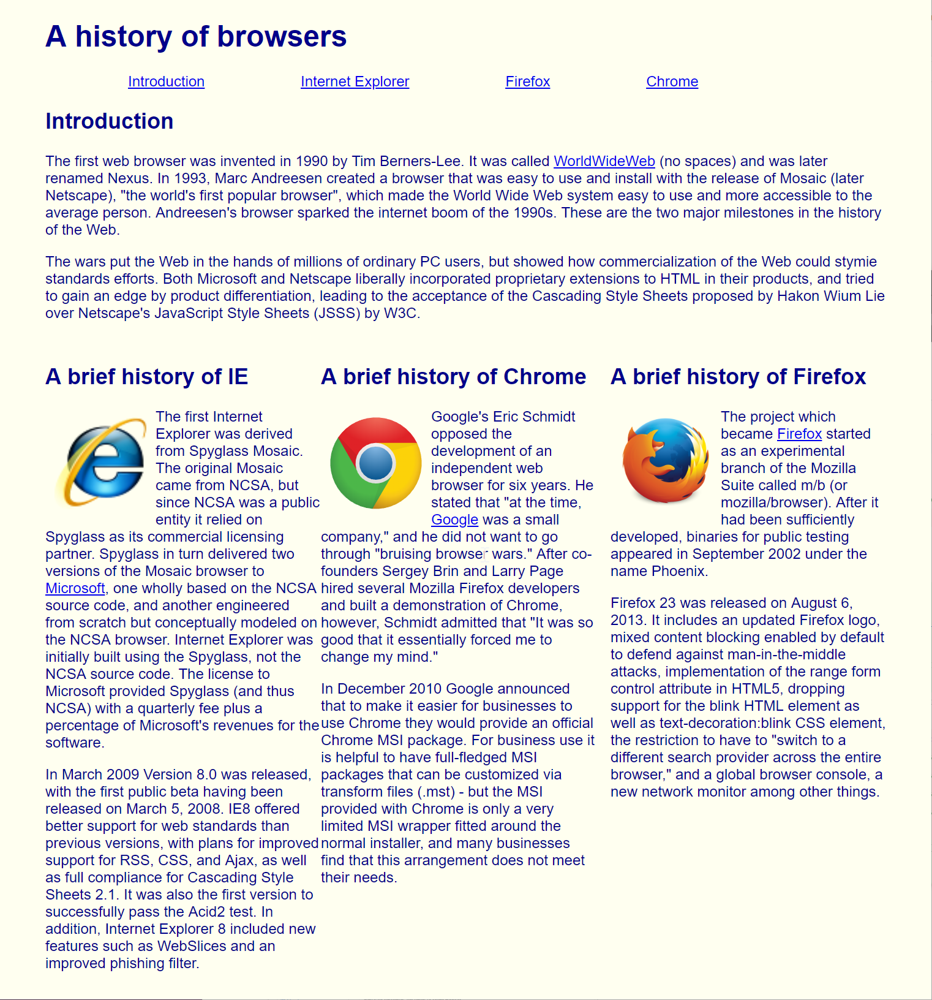
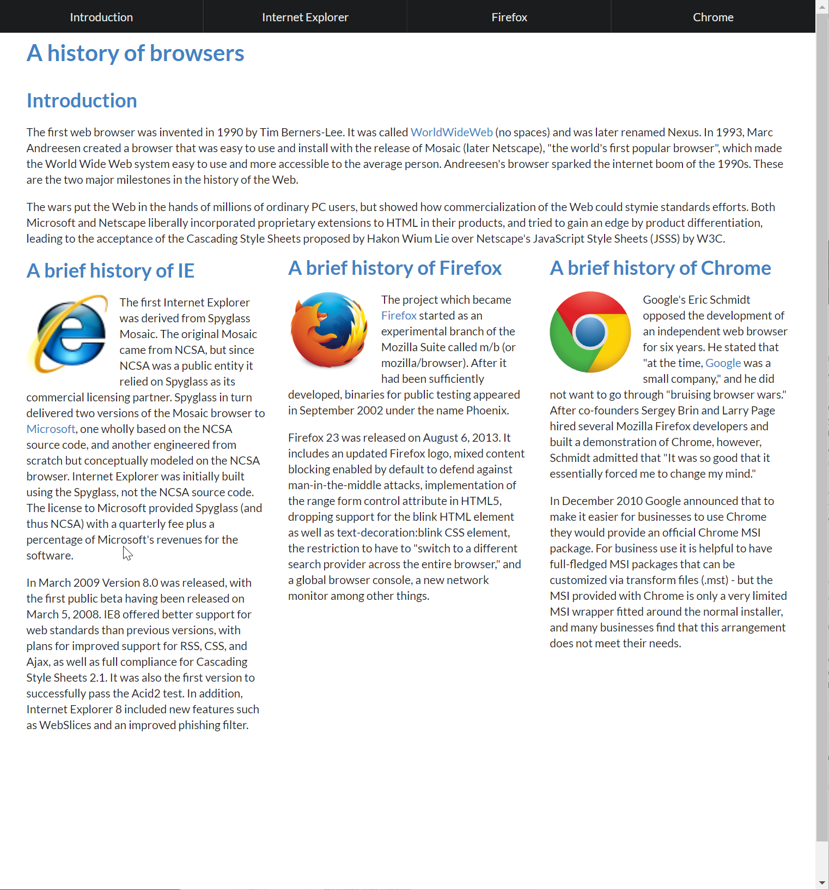

<h1> What is a UI framework? </h1>

A UI framework is a tool we can use to make life easier when designing the front end of a website. It provides a solid 
base of pre-written code that we can draw on to do what we want. If you want a menu bar? It most likely has some of the 
complicated CSS already written out and all you have to do is use the correct class. 

So what does a UI framework allow us to do? With about 10 minutes of time you can take your website from looking like
a 1995 angelfire page, to something more modern. For example take the original version of this simple site on the left, and
the updated version on the right using the Semantic UI framework.

Just looking at that transformation, you'd think someone had to have put a little bit of time into it, at least much more
than the previous version of the site. But, it actually took less time to do the second version than the first version!

<h2>Benefits</h2>
So what are the benefits of using a UI Framework? 
<ol>
  <li>Quickly design nice looking user interfaces</li>
  <li>The CSS and tools are usually well written, and tested much more than a single developer ever could</li>
  <li>Can allow you much more time to spend on harder tasks, rather than fighting a stubborn div that just won</li>
</ol>

<h2>Drawbacks</h2>

<ol>
  <li>It's good for starting out, but later on down the road you might have to fight framework if your site starts to get
  highly customized</li>
  <li>Updates to the framework might leave your site broken and unusable</li>
  <li>Can potentially lead to a bloated codebase</li>
</ol>

<h2>Should you use them?</h2>
Well that depends. Are you building a site that will not require a lot of highly customized designs?
Then absolutely! Though they shouldn't be used to cover up a lack of knowledge of html/css, that could potentially lead to 
just knowing the framework, and not the underlying language that powers it, and could leave you stagnated in your capabilities.

If your site is going to go against mainstream designs and looks nothing like anything the documentation for the framework provides,
then it's probably not a good fit for your project and would most likely require being designed from the ground up.

  