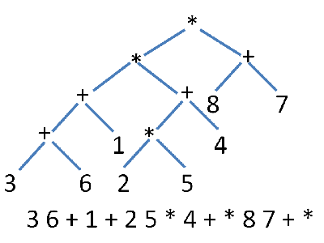

This is just a simple implementation of the Shunting Yard algorithm, used to parse infix notation, that I wrote in Java. It was the start of a graphical scientify calculator that life had to put on hold. I still plan to finish it, but probably during this summer.

It uses a few more advanced techniques in the java language such as implementing the Comparable interface and a stack. I mainly wrote it for the learning experience, as it was my first algorithm that I ever implemented by myself. While rather simple to some probably, it was a hurdle getting it to behave how I wanted and correctly.

The bulk of the logic is in this 
```java
 while (!operatorStack.isEmpty()
            && (operatorStack.peek().compareTo(operator) == 1
                || (operatorStack.peek().compareTo(operator) == 0
                    && operatorStack.peek().leftAssociative))
            && !operatorStack.peek().getOperator().equals("(")) {
          queue.add(operatorStack.pop().getOperator());
        }
        operatorStack.push(operator);
```


In this project I gained experience using a debugger, and using the Comparable interface in java, both make life a lot easier. I also found out that Java does not have a simple way of telling if something is numeric.
 
Source: <a href="https://github.com/acathers/ShuntingYard"><i class="large github icon"></i>ShuntingYard</a>