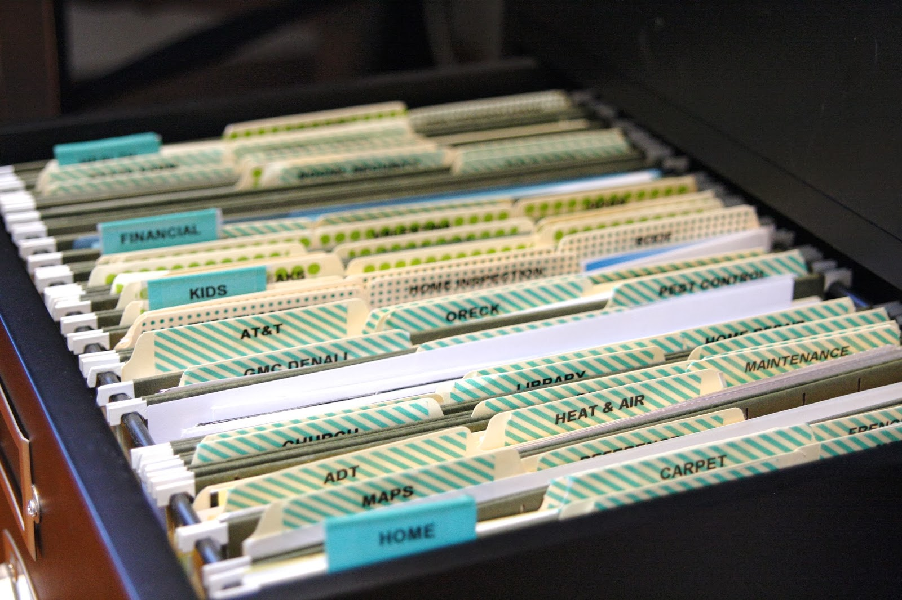

<div class="ui small rounded images">
  
  
  
</div>

At my current job closing the store required sifting through numerous reports and pulling data and putting it into a different report. This was a tedious task that I decided could be automated, and appealed heavily to my desire to get things done quickly.

For this project I used java, which is the language I am most comfortable with. All of our reports were in excel format, so for the reading/writing to the documents I used the Apache POI library. The main hurdle was that none of this data was in an easy to parse format, so basically I had to pick a cell on the report that would act as the base, and then hard code offsets for the data I wanted. 

Another issue was Apache POI itself. It seems to have gone through quite a few changes in its lifecycle and the documentation links to deprecation after deprecation. Finding the correct and current methods to do what I wanted was a bit like finding a needle in a haystack. 

Here is an example of how I had to set the base cell

```java
public boolean setStartRowAndCol(Workbook wb) { 
    Sheet sheet = wb.getSheetAt(0);
    DataFormatter dataFormatter = new DataFormatter();

    for (Row row : sheet) {
      for (Cell cell : row) {
        if (dataFormatter.formatCellValue(cell).equals("For Specified Date Range")) {
          startRow = cell.getRowIndex();
          startCol = cell.getColumnIndex();
          return true;
        }
      }
    }
    return false;
  }
```

If you wish to take a look at the full code (https://github.com/acathers/ReportGenerator)


